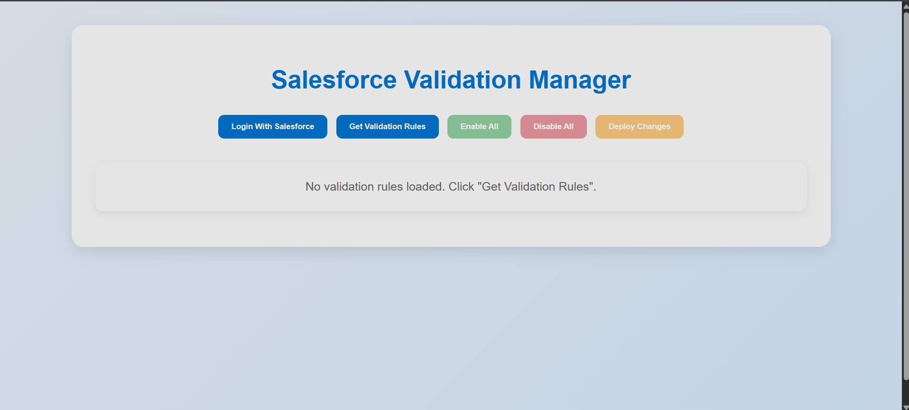
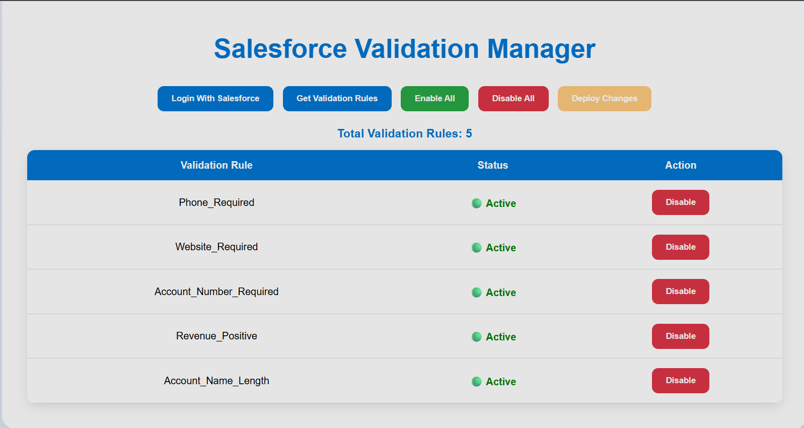
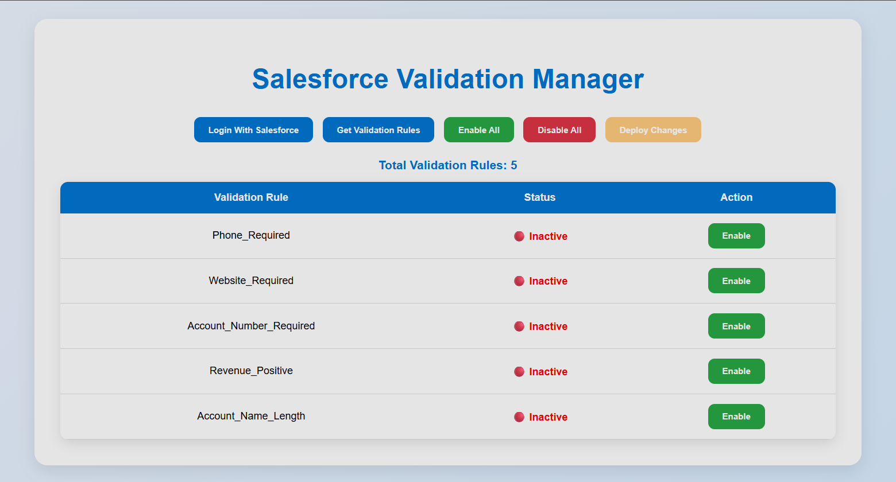
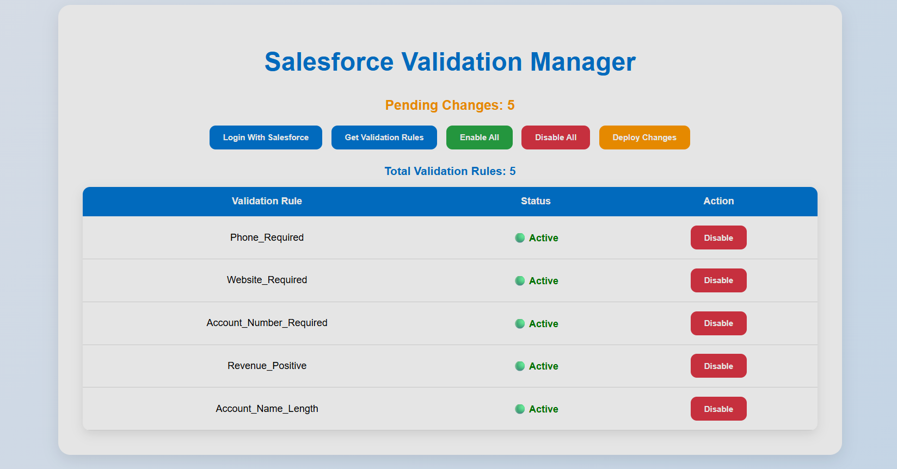
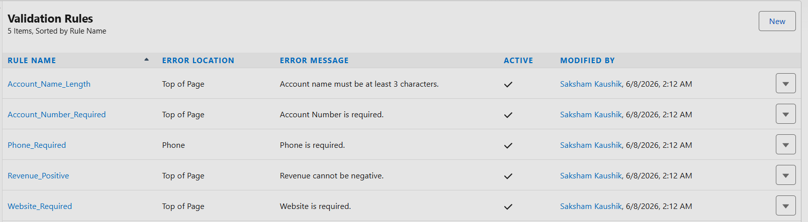

# Salesforce Validation Manager

A Salesforce administration tool built using **React.js**, **Node.js**, **Express.js**, **JSForce**, **Salesforce Tooling API**, and **Salesforce Metadata API**.

## Assignment Objective

Build a web application that connects with Salesforce using OAuth 2.0 and allows administrators to manage Validation Rules directly from a custom interface. The application fetches validation rules using Salesforce APIs and enables users to activate or deactivate them directly from the web application.

---

## Features

✅ Salesforce OAuth 2.0 Authentication

✅ Connected App Integration

✅ Fetch Validation Rules using Tooling API

✅ View Validation Rule Status

✅ Enable Individual Validation Rules

✅ Disable Individual Validation Rules

✅ Enable All Validation Rules

✅ Disable All Validation Rules

✅ Deploy Changes using Metadata API

✅ Real-Time Salesforce Synchronization

✅ Modern Responsive User Interface

---

## Technology Stack

### Frontend

* React.js
* Axios
* CSS3

### Backend

* Node.js
* Express.js
* JSForce

### Salesforce

* OAuth 2.0
* Connected App
* Tooling API
* Metadata API

---

## Architecture

Frontend (React.js)

↓

Backend (Node.js + Express.js)

↓

JSForce

↓

Salesforce OAuth 2.0

↓

Tooling API & Metadata API

---

## Project Workflow

### Step 1

Login using Salesforce OAuth 2.0.

### Step 2

Fetch Validation Rules from Salesforce.

### Step 3

Enable or Disable Validation Rules.

### Step 4

Review Pending Changes.

### Step 5

Deploy Changes.

### Step 6

Changes are reflected instantly inside Salesforce.

---

# Screenshots

## Login Page


---

## Home Page



---

## Validation Rules Loaded



---

## Disabled Rules



---

## Enabled Rules



---

## Salesforce Validation Rules (Enabled)



---

## Salesforce Validation Rules (Disabled)


---

# Installation

## Clone Repository

```bash
git clone https://github.com/ofsaksham/salesforce-validation-manager.git
```

---

## Backend Setup

```bash
cd backend

npm install

npm start
```

---

## Frontend Setup

```bash
cd frontend

npm install

npm start
```

---

# Environment Variables

Create a `.env` file inside the backend folder:

```env
CLIENT_ID=YOUR_CLIENT_ID
CLIENT_SECRET=YOUR_CLIENT_SECRET
LOGIN_URL=https://login.salesforce.com
REDIRECT_URI=http://localhost:5000/callback
PORT=5000
```

---

# Salesforce Configuration

## Connected App

Callback URL:

```text
http://localhost:5000/callback
```

OAuth Scopes:

* Full Access (full)
* Access and manage your data (api)
* Perform requests on your behalf at any time (refresh_token, offline_access)

---

# Folder Structure

```text
salesforce-validation-manager
│
├── backend
│   ├── server.js
│   └── package.json
│
├── frontend
│   ├── public
│   ├── src
│   └── package.json
│
├── screenshots
│   ├── login_page.png
│   ├── Home_page.png
│   ├── rules-loaded.png
│   ├── Disabled-page.png
│   ├── Enabled-page.png
│   ├── salesforce-enabled-rule.png
│   └── Salesforce-disabled-rule.png
│
└── README.md
```

---

# Assignment Requirements Covered

| Requirement                     | Status |
| ------------------------------- | ------ |
| Salesforce Developer Org        | ✅      |
| Connected App                   | ✅      |
| OAuth 2.0 Authentication        | ✅      |
| Validation Rules Creation       | ✅      |
| Fetch Validation Rules          | ✅      |
| Display Validation Rule Status  | ✅      |
| Enable/Disable Individual Rules | ✅      |
| Enable/Disable All Rules        | ✅      |
| Deploy Changes to Salesforce    | ✅      |
| Metadata API Usage              | ✅      |
| Tooling API Usage               | ✅      |
| Responsive User Interface       | ✅      |

---

# Author

### Saksham Kaushik

B.Tech Computer Science Engineering

GitHub: https://github.com/ofsaksham

Repository:
https://github.com/ofsaksham/salesforce-validation-manager

---

## Contact

If you have any questions regarding this project, feel free to contact me through GitHub.

---

## License

This project was created for learning and assignment purposes.
