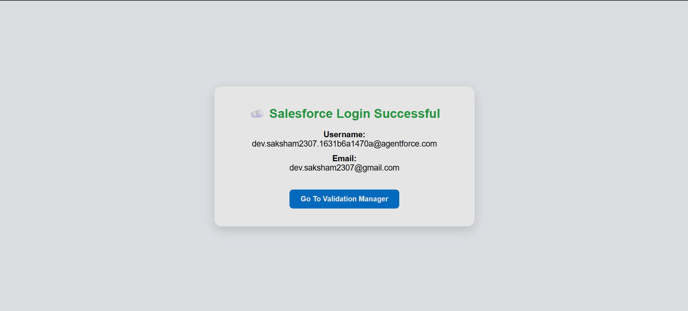
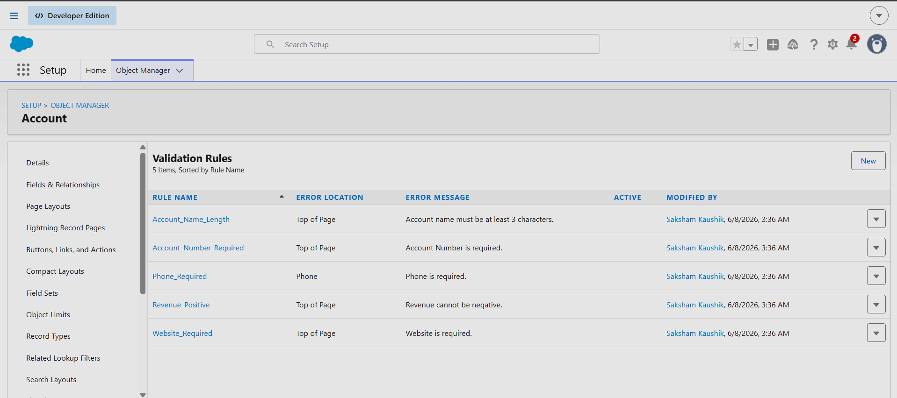

# Salesforce Validation Manager

A Salesforce administration tool built using React.js, Node.js, Express.js, JSForce, Salesforce Tooling API, and Salesforce Metadata API.

This application allows Salesforce administrators to:

- Login securely using Salesforce OAuth 2.0
- Fetch Validation Rules from Salesforce
- View Active/Inactive status
- Enable or Disable individual Validation Rules
- Enable or Disable all Validation Rules at once
- Deploy changes directly to Salesforce
- Verify updates instantly in Salesforce Setup

---

## Features

✅ Salesforce OAuth Login

✅ Fetch Validation Rules using Tooling API

✅ View Validation Rule Status

✅ Enable Single Validation Rule

✅ Disable Single Validation Rule

✅ Enable All Validation Rules

✅ Disable All Validation Rules

✅ Deploy Changes to Salesforce using Metadata API

✅ Modern Responsive UI

✅ Real-time Salesforce Synchronization

---

## Technology Stack

### Frontend
- React.js
- Axios
- CSS3

### Backend
- Node.js
- Express.js
- JSForce

### Salesforce
- OAuth 2.0
- Tooling API
- Metadata API
- Connected App

---

## Project Workflow

### Step 1
Login using Salesforce OAuth.

### Step 2
Fetch Validation Rules from Salesforce.

### Step 3
Toggle Validation Rules (Enable / Disable).

### Step 4
Review Pending Changes.

### Step 5
Deploy Changes.

### Step 6
Changes are reflected directly inside Salesforce.

---

# Screenshots

## Login Page



---

## Home Page


---

## Validation Rules Loaded


---

## Disabled Rules


---

## Enabled Rules


---

## Salesforce Validation Rules (Enabled)


---

## Salesforce Validation Rules (Disabled)



---

# Installation

## Clone Repository

```bash
git clone https://github.com/ofsaksham/salesforce-validation-manager.git
```

## Backend Setup

```bash
cd backend

npm install

npm start
```

---

## Frontend Setup

```bash
cd frontend

npm install

npm start
```

---

# Environment Variables

Create a `.env` file inside backend:

```env
CLIENT_ID=YOUR_CLIENT_ID

CLIENT_SECRET=YOUR_CLIENT_SECRET

LOGIN_URL=https://login.salesforce.com

REDIRECT_URI=http://localhost:5000/callback

PORT=5000
```

---

# Salesforce Configuration

## Connected App

Callback URL:

```text
http://localhost:5000/callback
```

OAuth Scopes:

- Full Access (full)
- Access and manage your data (api)
- Perform requests on your behalf at any time (refresh_token, offline_access)

---

# Folder Structure

```text
SALESFORCE PROJECT
│
├── backend
│   ├── server.js
│   ├── package.json
│   └── .env
│
├── frontend
│   ├── src
│   ├── public
│   └── package.json
│
├── screenshots
│   ├── login_page.png
│   ├── Home page.png
│   ├── rules-loaded.png
│   ├── Disabled-page.png
│   ├── Enabled-page.png
│   ├── salesforce-enabled-rule.png
│   └── Salesforce-disabled-rule.png
│
└── README.md
```

---

# Assignment Requirements Covered

| Requirement | Status |
|------------|---------|
| Salesforce Login | ✅ |
| Connected App | ✅ |
| OAuth 2.0 | ✅ |
| Fetch Validation Rules | ✅ |
| Display Status | ✅ |
| Enable/Disable Single Rule | ✅ |
| Enable/Disable All Rules | ✅ |
| Deploy Changes | ✅ |
| Salesforce Synchronization | ✅ |
| Responsive UI | ✅ |

---

# Author

### Saksham Kaushik

B.Tech Computer Science Engineering

GitHub: https://github.com/ofsaksham

---

## Contact

If you have any questions regarding this project, feel free to contact me through GitHub.
